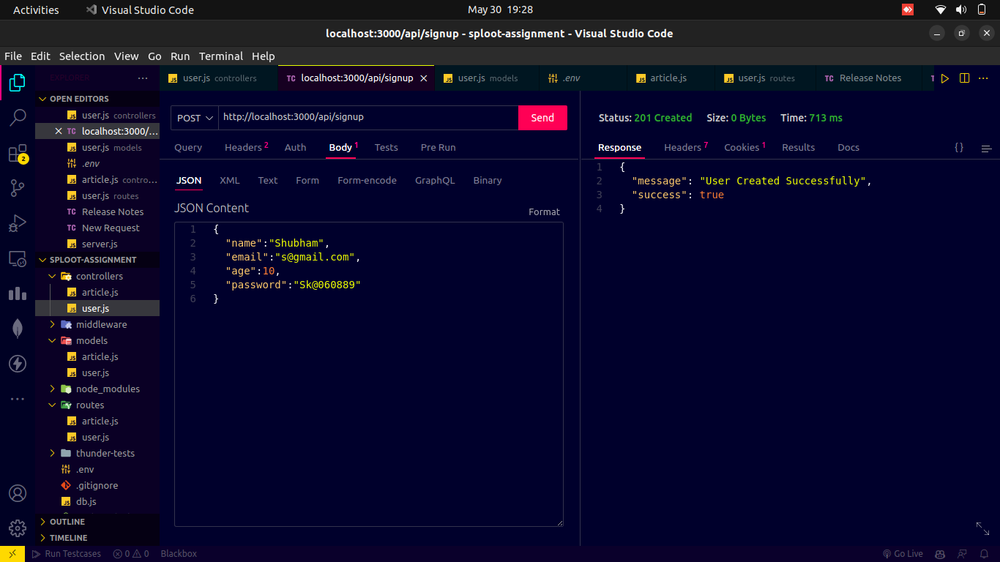
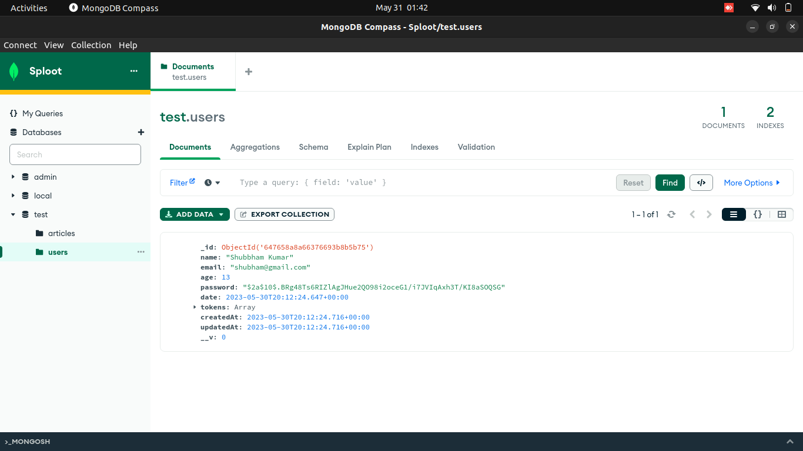
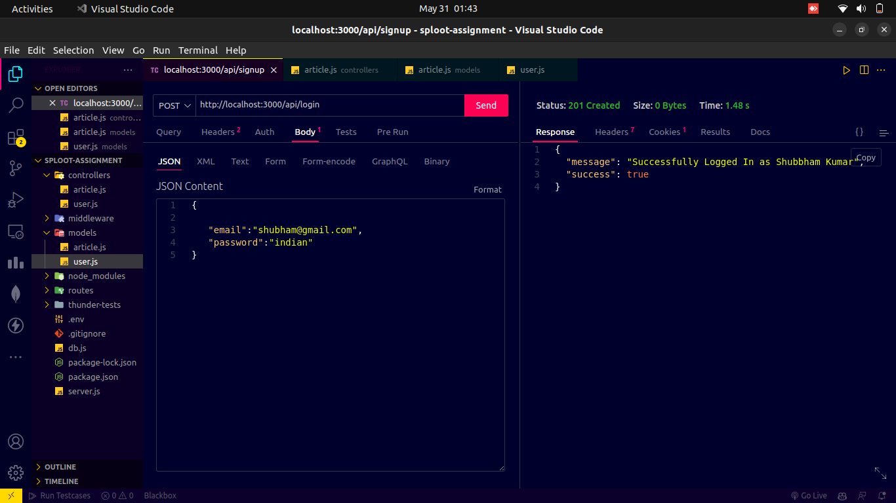
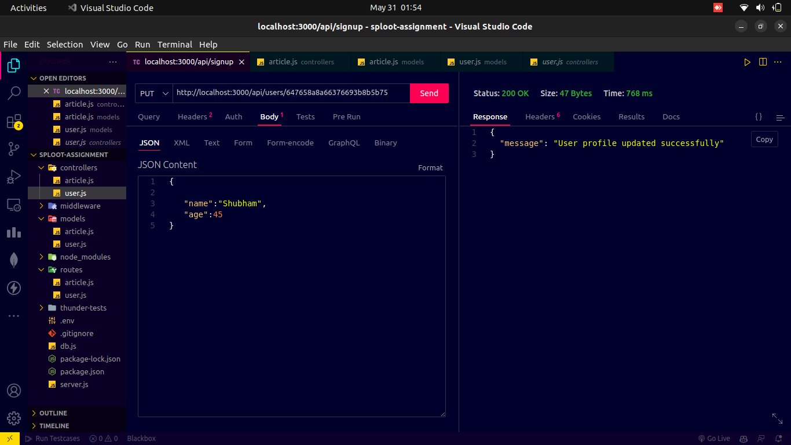
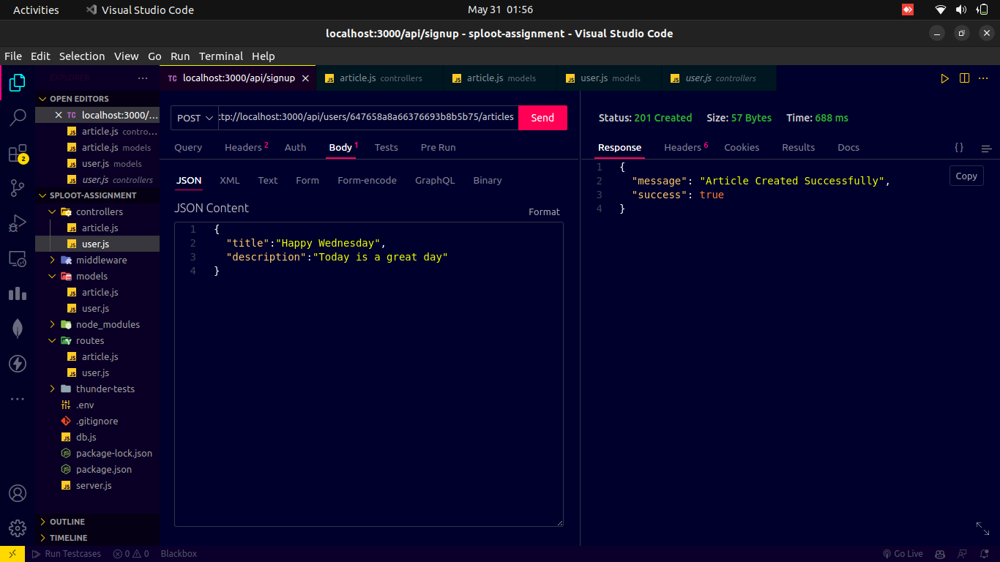
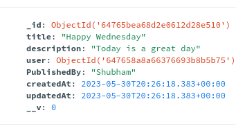
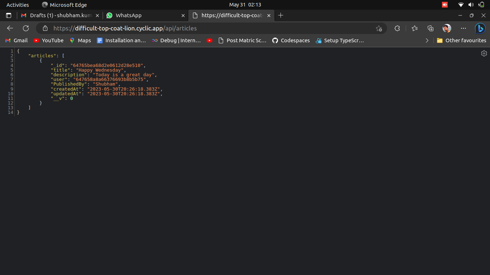

# User Authentication and Article Management API

This project provides a User Authentication and Article Management API. It allows users to sign up, log in, create articles, retrieve articles, and update their user profile. The API uses JSON format for requests and responses.

## Features

- User signup with email and password
 ```json
{
  "email": "user@example.com",
  "password": "password123",
  "name": "John Doe",
  "age": 25
}
```
Response
 ```json
{
  "statusCode": 200,
  "data": {
    "data": {
      "user": {
        "email": "user@example.com",
        "name": "John Doe",
        "age": 25
      }
    }
  },
  "message": "User signed up successfully!"
}
```
- User login with email and password
 ```json
{
  "email": "user@example.com",
  "password": "password123"
}
```
Response
 ```json
{
  "statusCode": 200,
  "data": {
    "data": {
      "token": "<JWT token>"
    }
  },
  "message": "User logged in successfully!"
}
```
- Create an article
 ```json
{
  "title": "My Article",
  "description": "Lorem ipsum dolor sit amet, consectetur adipiscing elit."
}
```
Response
 ```json
{
  "statusCode": 200,
  "data": {
    "data": {
      "article": {
        "title": "My Article",
        "description": "Lorem ipsum dolor sit amet, consectetur adipiscing elit.",
        "author": "user@example.com"
      }
    }
  },
  "message": "Article created successfully!"
}
```
```
- Get all articles
 This protected API allows an authenticated user to create an article. The JWT token must be included in the authorization header of the request.
  ```json
  {
  "statusCode": 200,
  "data": {
    "data": [
      {
        "title": "Article 1",
        "description": "Lorem ipsum dolor sit amet.",
        "author": "user1@example.com"
      },
      {
        "title": "Article 2",
        "description": "Consectetur adipiscing elit.",
        "author": "user2@example.com"
      }
    ]
  },
  "message": "Articles retrieved successfully!"
}

```
- Update user profile
 ```json
{
  "name": "John Smith",
  "age": 30
}
 ```
Response 
 ```json
{
  "statusCode": 200,
  "data": {
    "data": {
      "user": {
        "email": "user@example.com",
        "name": "John Smith",
        "age": 30
      }
    }
  },
  "message": "User profile updated successfully!"
}
```
## Points to Remember
- All APIs follow REST principles, including proper request methods and headers.
- Basic validations are implemented for request inputs, ensuring no duplicate users and proper error responses.
- Passwords are stored in an encrypted format using the bcrypt encryption library.
- JWT tokens are used for user authentication and should be included in the headers of subsequent API requests.
- The response format of all APIs follows the standard structure:

/api/signup(for signing up new user)

/api/login(for login)








